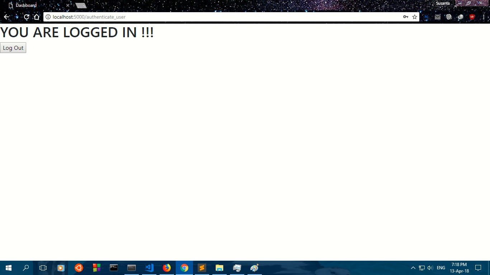

# Web based Facial Authentication system
This is a web based facial log in/ Sign up website which uses Facial recognition for user authentication.

It uses flask **server** for running the keras neural network model. 
The model runs on the server side and accepts requests from clients.

Facial recognition is based on Facenet model.

Team members:
**[Susanta Biswas](https://github.com/susantabiswas)** and **[Aditya Singh](https://github.com/adibyte95)**

For running:
1. first run
python keras_server.py
2. go to browser and type **localhost:5000** to access the site
3. enjoy

Some screenshots:
 
### Homepage

### Login page

### Sign up page

### Successful login

#### References:
- Code for Facenet model is based on the assignment from Convolutional Neural Networks Specialization by Deeplearning.ai on Coursera. 
https://www.coursera.org/learn/convolutional-neural-networks/home/welcome 
- Florian Schroff, Dmitry Kalenichenko, James Philbin (2015). [FaceNet: A Unified Embedding for Face Recognition and Clustering](https://arxiv.org/pdf/1503.03832.pdf)
- Yaniv Taigman, Ming Yang, Marc'Aurelio Ranzato, Lior Wolf (2014). [DeepFace: Closing the gap to human-level performance in face verification](https://research.fb.com/wp-content/uploads/2016/11/deepface-closing-the-gap-to-human-level-performance-in-face-verification.pdf) 
- The pretrained model used is inspired by Victor Sy Wang's implementation and was loaded using his code: https://github.com/iwantooxxoox/Keras-OpenFace.
- A lot of inspiration from the official FaceNet github repository: https://github.com/davidsandberg/facenet 
